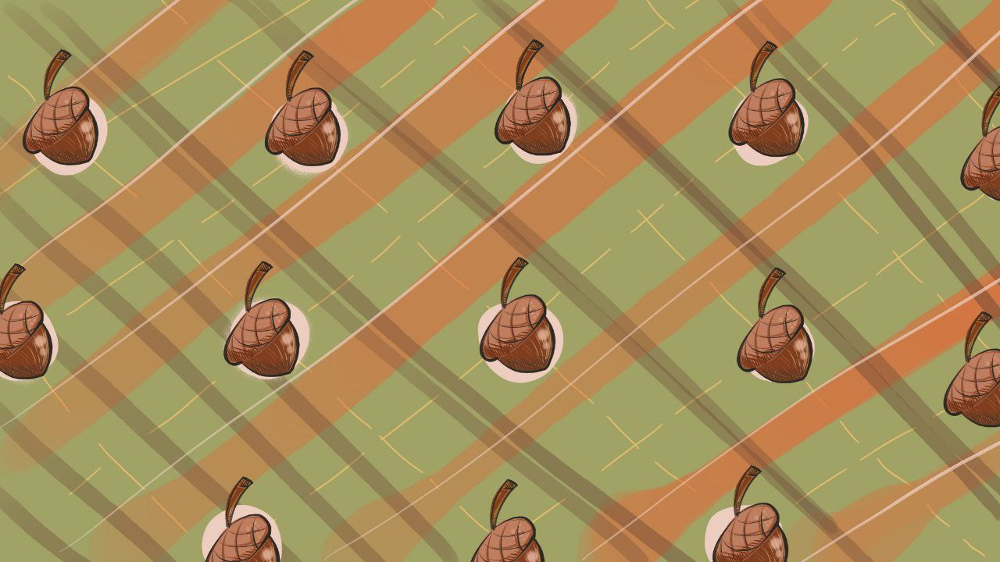
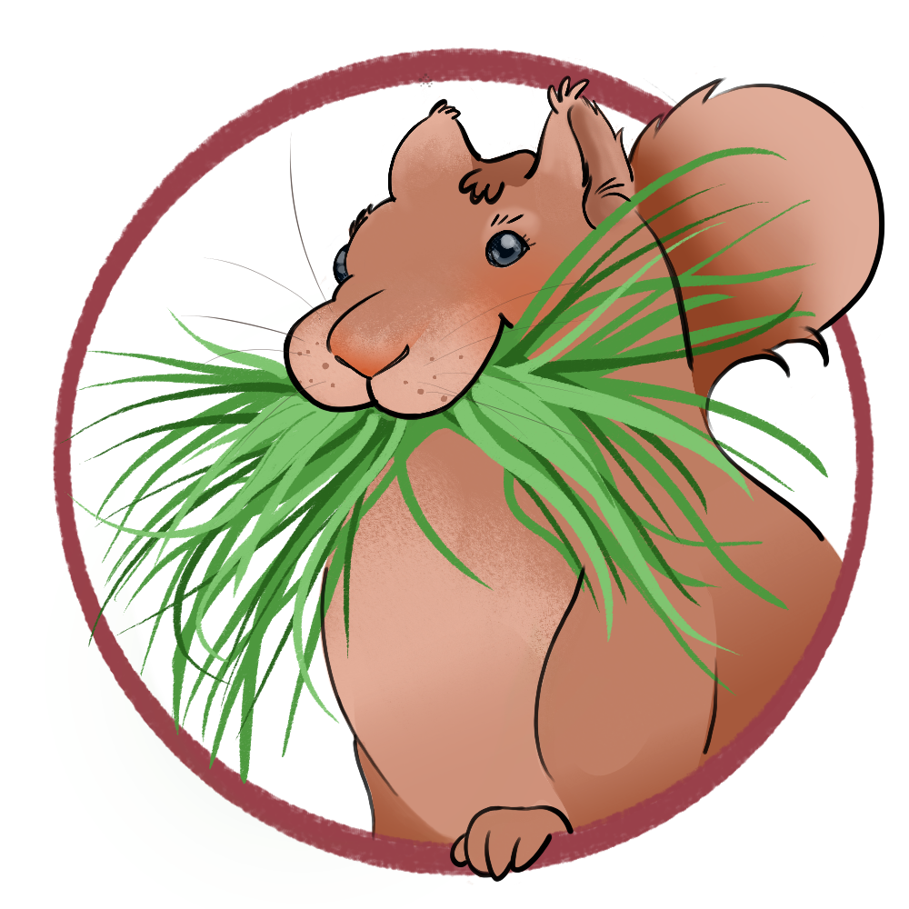

<div id="top"></div>

<!-- PROJECT SHIELDS -->

<!-- PROJECT LOGO -->
<br />
<div align="center">
  <a href="https://github.com/christopher-chandler/repo_name">
<br>
    
  </a>

 
[![Stargazers][stars-shield]][stars-url]


<h3 align="center">Christopher M. Chandler </h3>

  <p align="center">
    An aspiring  programmer and language nerd who wants to specialise in NLP and deep learning.
    <br />
    <br />
 


<br>


</div>

<!-- TABLE OF CONTENTS -->
<details>
  <summary>Table of Contents</summary>
  <ol>
    <li>
      <a href="#Introduction">Introduction</a>
    </li>
    <li>
      <a href="#About-me">About me</a>
      <ul>
        <li><a href="#Languages">Languages</a></li>
        <li><a href="#Literature">Literature</a></li>
        <li><a href="#Podcast">Podcast</a></li>
       </ul>
    </li>
    <li><a href="#Goals">Goals</a></li>
    <li><a href="#Collaboration">Collaboration</a></li>
    <li><a href="#contact">Contact</a></li>
    <li><a href="#acknowledgments">Acknowledgments</a></li>
  </ol>
</details>

 
## Introduction 

Hello everyone, my name is Christopher Chandler, and I am an aspiring programmer! 
If you speak Japanese, then please feel free to call me <ruby><rb>栗栖</rb><rt>クリス</rt><ruby>! 
If you do not speak Japanese, then please simply call me Chris! And if you are Japanese, then
I am sure that you will understand my logo. 

<p align="right">(<a href="#top">back to top</a>)</p>


## About me
I am an American based in Germany at the moment. 
I have been interested in computers for my whole life, 
but I got into programming at the end of 2019. 
I am working on a multitude of passion projects and tools at the moment to improve my coding skills. 
I am mostly interested in NLP tasks as that was my minor in my double major:
* General French Philology
* Linguistics with a minor in Computational Linguistics

### Languages

Besides programming, I am very much interested in languages: 
* English (Native)
* German (C2)
* French (C1)
* Japanese (A2)
* I have also dabbled in
    * Russian, Italian, Korean, Chinese, Portuguese, Dutch and Spanish

### Literature
My love for languages also extends to poetry. I am currently working on a couple of poetry books. 
I have been writing poetry for almost 15 years now, and I would consider it to be a greater passion of mine than even coding.
I enjoy reading novels, especially non-fiction. 
At the moment, I spend a lot of time reading on my Kindle whenever I get the chance.

### Podcast

I am super into podcasts, and I have created one of my own
where I talk about [American culture](https://open.spotify.com/show/1PJKOQG5hVyZRTNrs2IwBl) with my co-host. 
Feel free to check it out!

## Goals
```
Thousands of candles can be lit from a single candle, 
and the life of the candle will not be shortened. 
Happiness never decreases by being shared.

- Buddha 
```
I want to contribute to worthwhile projects and improve my coding skills in the process.
I also hope to be able to teach coding to those who are also willing to learn.
My biggest goal is to get into deep learning to better perform NLP tasks 
and to understand the deeper side of things.


<!-- CONTRIBUTING -->
## Collaboration

Contributions and collaborations are what make the open source community such an amazing place to learn, inspire, and create.
Any contributions you make are **greatly appreciated**.

If you have a suggestion that would make any of my projects better, please fork the respective repo and create a pull request.
You can also simply open an issue with the tag "enhancement".
Don't forget to give the project a star! Thanks again!

1. Fork the Project
2. Create your Feature Branch (`git checkout -b feature/AmazingFeature`)
3. Commit your Changes (`git commit -m 'Add some AmazingFeature'`)
4. Push to the Branch (`git push origin feature/AmazingFeature`)
5. Open a Pull Request

I am highly interested in collaborating. Even if it is not within the realm of deep learning or NLP,
please feel free to contact me. Maybe we can both discover something new, who knows?

<p align="right">(<a href="#top">back to top</a>)</p>

<!-- CONTACT -->
## Contact

Christopher Chandler - christopher.chandler@outlook.de
 
<p align="right">(<a href="#top">back to top</a>)</p>

<!-- ACKNOWLEDGMENTS -->
## Acknowledgments

My friend who created the logo for my Github account.  
* Yohanna Camaran - yohannacamarana at gmail dot com


<p align="right">(<a href="#top">back to top</a>)</p>


<!-- MARKDOWN LINKS & IMAGES -->
<!-- https://www.markdownguide.org/basic-syntax/#reference-style-links -->

[contributors-shield]: https://img.shields.io/github/contributors/christopher-chandler/repo_name?color=green&logoColor=%20
[contributors-url]: https://github.com/christopher-chandler/repo_name/graphs/contributors

[stars-shield]: https://img.shields.io/github/stars/christopher-chandler?color=%20&logoColor=yellow&style=social
[stars-url]: https://github.com/christopher-chandler/repo_name/stargazers

[license-shield]: https://img.shields.io/github/license/christopher-chandler/repo_name?color=yellow
[license-url]: https://github.com/christopher-chandler/repo_name/blob/master/LICENSE.txt

[download-shield]: https://img.shields.io/github/downloads/christopher-chandler/repo_name/total
[update-shield]: https://img.shields.io/badge/Last_Updated-MONTH_YEAR-blue
